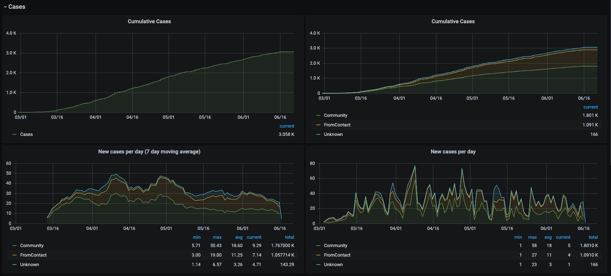
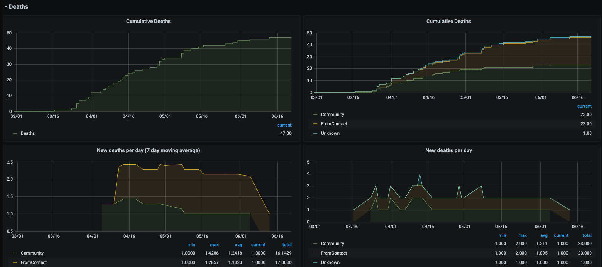

# San Francisco COVID-19 Dashboard
I created this small dashboard to visualize the COVID-19 data published by the
San Francisco local government. The current dashboards available online do not
have a moving average view, so it is very difficult to see trends.

## Screenshots



## Components
* Data source: [DataDF - COVID-19 Cases Summarized by Date, Transmission and
  Case Disposition](https://data.sfgov.org/COVID-19/COVID-19-Cases-Summarized-by-Date-Transmission-and/tvq9-ec9w)
  * HTTP/JSON API: `https://data.sfgov.org/resource/tvq9-ec9w.json`
* InfluxDB to house the timeseries data
* Grafana to create the dashboard
* Simple application to grab data from JSON API and write to InfluxDB
  * Scala 2.13
  * Akka for HTTP queries
  * Cats for simple error handling with asynchronous calls
  * Circe for JSON parsing

## Usage
### Bring up docker images
Note that the `docker-compose.yaml` file is just taken from the
[docker-compose-influxdb-grafana](https://github.com/jkehres/docker-compose-influxdb-grafana)
project.

```
$ docker-compose -f docker-compose.yaml up
```

### Load data into Influx
```
$ cd sf-covid-data-importer
$ sbt run
```

## First time setup
### Create the database in InfluxDB 
* `http://localhost:8888/` to load up Chronograf
* "InfluxDB Admin"
* Create database (default name in application is `sf_covid`)

### Connect Grafana to InfluxDB
* `http://localhost:3000/`
* Data sources
* Add data source
  * InfluxDB
  * URL = `http://host.docker.internal:8086/`
  * Database = `sf_covid`

### Import Dashboard
* `http://localhost:3000/`
* Import
* Select `dashboard/Covid-19 SF.json`

## TODO
* [ ] Unit tests
* [ ] Automate bootstrapping steps above
* [ ] Generalize to other data sources
